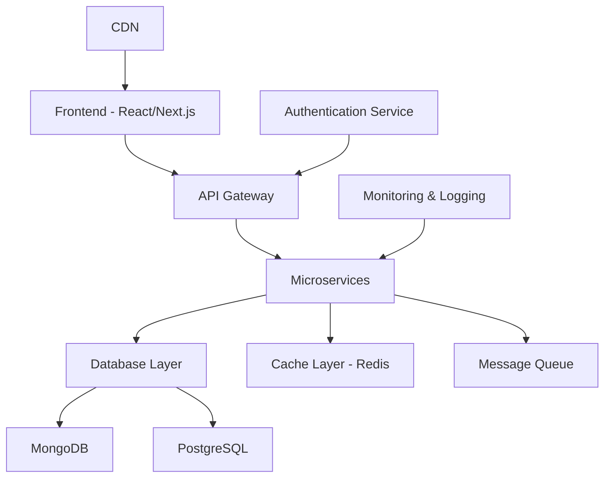

<div align="center">
  
</div>

<div align="center">
  
</div>

<div align="center">
  
  
  
  
</div>

<br/>

<div align="center">
  
</div>


##  **About Me**

<picture>
  <source media="(max-width: 768px)" srcset="https://user-images.githubusercontent.com/74038190/229223263-cf2e4b07-2615-4f87-9c38-e37600f8381a.gif">
  
</picture>

```typescript
const sumitRathore: Developer = {
    name: "Sumit Rathore",
    role: "Full Stack MERN Developer",
    education: {
        degree: "Bachelor of Technology",
        year: "2nd Year",
        specialization: "Computer Science & Engineering",
        institution: "Top Engineering College"
    },
    location: {
        country: "India 🇮🇳",
        timezone: "GMT+5:30",
        workingHours: "9 AM - 11 PM IST"
    },
    currentProjects: [
        {
            name: "Edusavvy",
            type: "EdTech Platform",
            stack: ["React", "Node.js", "MongoDB"],
            status: "In Development 🚧"
        },
        {
            name: "Hackshtra",
            type: "Hackathon Management System",
            stack: ["MERN", "Socket.io", "AWS"],
            status: "Beta Testing 🧪"
        },
        {
            name: "Devndez",
            type: "Developer Community Platform",
            stack: ["Next.js", "TypeScript", "PostgreSQL"],
            status: "Planning Phase 📋"
        }
    ],
    techStack: {
        frontend: {
            frameworks: ["React.js", "Next.js", "Vue.js"],
            languages: ["JavaScript", "TypeScript", "HTML5", "CSS3"],
            styling: ["Tailwind CSS", "SCSS", "Styled Components"],
            stateManagement: ["Redux", "Context API", "Zustand"],
            testing: ["Jest", "React Testing Library", "Cypress"]
        },
        backend: {
            runtime: ["Node.js", "Deno"],
            frameworks: ["Express.js", "Fastify", "Koa.js"],
            databases: ["MongoDB", "PostgreSQL", "Redis", "Firebase"],
            authentication: ["JWT", "OAuth", "Passport.js"],
            apiDesign: ["REST", "GraphQL", "WebSockets"]
        },
        devops: {
            cloud: ["Google Cloud Platform", "AWS", "Vercel"],
            containerization: ["Docker", "Docker Compose"],
            cicd: ["GitHub Actions", "GitLab CI"],
            monitoring: ["PM2", "New Relic"],
            deployment: ["Netlify", "Heroku", "Railway"]
        },
        tools: {
            versionControl: ["Git", "GitHub", "GitLab"],
            editors: ["VS Code", "WebStorm", "Vim"],
            design: ["Figma", "Adobe XD", "Canva"],
            productivity: ["Notion", "Slack", "Discord"]
        }
    },
    currentlyLearning: [
        "Microservices Architecture",
        "Kubernetes & Container Orchestration",
        "System Design & Scalability",
        "Web3 & Blockchain Development",
        "AI/ML Integration in Web Apps"
    ],
    interests: [
        "Open Source Contribution",
        "Technical Writing & Blogging",
        "Mentoring Junior Developers",
        "Hackathons & Coding Competitions",
        "Community Building"
    ],
    achievements: {
        hackathons: ["Winner at TechFest 2024", "Top 10 in National Hackathon"],
        certifications: ["Google Cloud Certified", "MongoDB Certified Developer"],
        contributions: ["20+ Open Source PRs", "5 Published NPM Packages"],
        community: ["Tech Community Lead", "100+ Students Mentored"]
    },
    lifePhilosophy: "Code with passion, build with purpose, share with community! ✨",
    funFacts: [
        "I can debug code faster with console.log() than any debugger! 😄",
        "My code works on my machine... and in production too! 🚀",
        "I've written more 'Hello World' programs than I can count 👋",
        "Coffee is my debugging rubber duck ☕"
    ]
};

// Always learning, always building, always growing! 🌱
console.log("Welcome to my GitHub profile! Let's connect and build amazing things together! 🚀");
```

### 🎯 **Current Focus Areas**

<div align="center">

| 🔭 **Working On** | 🌱 **Learning** | 👯 **Collaborating** | 💬 **Ask Me About** |
|:-----------------:|:---------------:|:--------------------:|:--------------------:|
| Full-Stack Web Apps | DevOps & Cloud | Open Source Projects | MERN Stack |
| Mobile Development | System Design | Startup Ideas | JavaScript/TypeScript |
| API Development | Microservices | Community Building | React Ecosystem |
| UI/UX Design | Web3 Technologies | Mentorship Programs | Career Guidance |

</div>

### 📊 **Quick Stats**

<div align="center">


</div>


##  **Tech Arsenal & Skills**

<div align="center">

### **💻 Frontend Development**


### **⚙️ Backend Development**


### **☁️ DevOps & Cloud**


### **🛠️ Development Tools**


### **📱 Mobile & Others**


</div>

### 🎨 **Skill Proficiency**

<div align="center">

```text
JavaScript/TypeScript  ████████████████████   100%
React.js/Next.js      ████████████████████    95%
Node.js/Express       ████████████████████    90%
MongoDB/Database      ████████████████████    85%
Cloud/DevOps          ████████████████████    80%
System Design         ████████████████████    75%
Mobile Development    ████████████████████    70%
UI/UX Design          ████████████████████    85%
```

</div>

<div align="center">
  
</div>


##  **GitHub Analytics & Statistics**

<div align="center">

### **📈 GitHub Stats Overview**

<picture>
  <source media="(max-width: 768px)" srcset="https://github-readme-stats.vercel.app/api?username=sumitrathore&show_icons=true&theme=tokyonight&hide_border=true&count_private=true&include_all_commits=true&custom_title=GitHub%20Stats&card_width=350">
  
</picture>

<picture>
  <source media="(max-width: 768px)" srcset="https://github-readme-stats.vercel.app/api/top-langs/?username=sumitrathore&layout=compact&theme=tokyonight&hide_border=true&langs_count=10&custom_title=Most%20Used%20Languages&card_width=350">
  
</picture>

### **🔥 GitHub Streak Stats**


### **📊 Detailed Language Statistics**


### **⚡ GitHub Activity Graph**


### **📅 Commit Calendar**


</div>


##  **Achievements & Trophies**

<div align="center">

### **🏆 GitHub Trophies**


### **🎖️ Professional Achievements**

| 🏅 **Category** | 🎯 **Achievement** | 📅 **Year** | 🔗 **Proof** |
|:---------------:|:------------------:|:-----------:|:-------------:|
| 🏆 Hackathons | Winner - TechFest 2024 | 2024 | [Certificate](#) |
| 🥇 Competitions | Top 10 - National Coding Championship | 2024 | [Leaderboard](#) |
| 📜 Certifications | Google Cloud Professional Developer | 2024 | [Badge](#) |
| 📚 Education | MongoDB Certified Developer | 2023 | [Certificate](#) |
| 🌟 Open Source | 20+ Merged Pull Requests | 2023-24 | [GitHub](#) |
| 📦 NPM | 5 Published Packages | 2023-24 | [npm Profile](#) |
| 👨‍🏫 Mentorship | 100+ Students Mentored | 2023-24 | [Community](#) |
| 📝 Writing | 25+ Technical Articles | 2023-24 | [Blog](#) |

### **📈 Contribution Stats**

<div align="center">


</div>

</div>


##  **Featured Projects & Portfolio**

<div align="center">

### **🚀 Flagship Projects**

<div style="display: flex; flex-wrap: wrap; justify-content: center; gap: 20px;">

<a href="https://github.com/sumitrathore/edusavvy">
  
</a>

<a href="https://github.com/sumitrathore/hackshtra">
  
</a>

<a href="https://github.com/sumitrathore/devndez">
  
</a>

<a href="https://github.com/sumitrathore/portfolio">
  
</a>

<a href="https://github.com/sumitrathore/react-components">
  
</a>

<a href="https://github.com/sumitrathore/api-collection">
  
</a>

</div>

### **💼 Project Categories**

| 🎯 **Category** | 📊 **Count** | 🔧 **Tech Stack** | 🌟 **Status** |
|:---------------:|:------------:|:------------------:|:--------------:|
| 🌐 Web Applications | 8 | MERN, Next.js | Active |
| 📱 Mobile Apps | 3 | Flutter, React Native | Development |
| 🔌 APIs & Backend | 5 | Node.js, Express | Production |
| 🎨 UI Components | 4 | React, Storybook | Maintained |
| 🛠️ Dev Tools | 3 | Node.js, CLI | Open Source |
| 📚 Learning Projects | 10 | Various | Archive |

### **🏗️ Architecture & Design Patterns**

<div align="center">



</div>

</div>


##  **Connect & Collaborate**

<div align="center">

### **🌐 Social Media & Professional Networks**

<table>
<tr>
<td align="center" width="25%">
<a href="mailto:yourname@gmail.com">

<br/>📧 <b>Email</b>
<br/>Professional Inquiries
</a>
</td>
<td align="center" width="25%">
<a href="https://linkedin.com/in/yourname">

<br/>💼 <b>LinkedIn</b>
<br/>Professional Network
</a>
</td>
<td align="center" width="25%">
<a href="https://twitter.com/yourusername">

<br/>🐦 <b>Twitter</b>
<br/>Tech Updates & Thoughts
</a>
</td>
<td align="center" width="25%">
<a href="https://instagram.com/yourusername">

<br/>📸 <b>Instagram</b>
<br/>Behind the Scenes
</a>
</td>
</tr>
<tr>
<td align="center" width="25%">
<a href="https://yourportfolio.com">

<br/>🌟 <b>Portfolio</b>
<br/>Showcase & Resume
</a>
</td>
<td align="center" width="25%">
<a href="https://dev.to/yourusername">

<br/>✍️ <b>Dev.to</b>
<br/>Technical Articles
</a>
</td>
<td align="center" width="25%">
<a href="https://medium.com/@yourusername">

<br/>📝 <b>Medium</b>
<br/>Long-form Content
</a>
</td>
<td align="center" width="25%">
<a href="https://youtube.com/@yourusername">

<br/>🎥 <b>YouTube</b>
<br/>Coding Tutorials
</a>
</td>
</tr>
</table>

### **💬 Developer Communities**

<div align="center">

[](https://discord.gg/yourinvite)
[](https://yourslack.slack.com)
[](https://reddit.com/u/yourusername)
[](https://stackoverflow.com/users/yourid)

</div>

### **📊 Coding Profiles**

<div align="center">

[](https://leetcode.com/yourusername)
[](https://hackerrank.com/yourusername)
[](https://codechef.com/users/yourusername)
[](https://codeforces.com/profile/yourusername)

</div>

### **🤝 Collaboration Opportunities**

<div align="center">

| 🎯 **Looking For** | 💡 **Offering** | 🚀 **Interests** |
|:-----------------:|:---------------:|:-----------------:|
| Open Source Contributions | Mentorship & Guidance | Startup Ideas |
| Freelance Projects | Code Reviews | Tech Discussions |
| Remote Opportunities | Technical Writing | Community Building |
| Partnership & Co-founding | Workshop Conducting | Knowledge Sharing |

</div>

</div>


##  **Support My Work & Growth**

<div